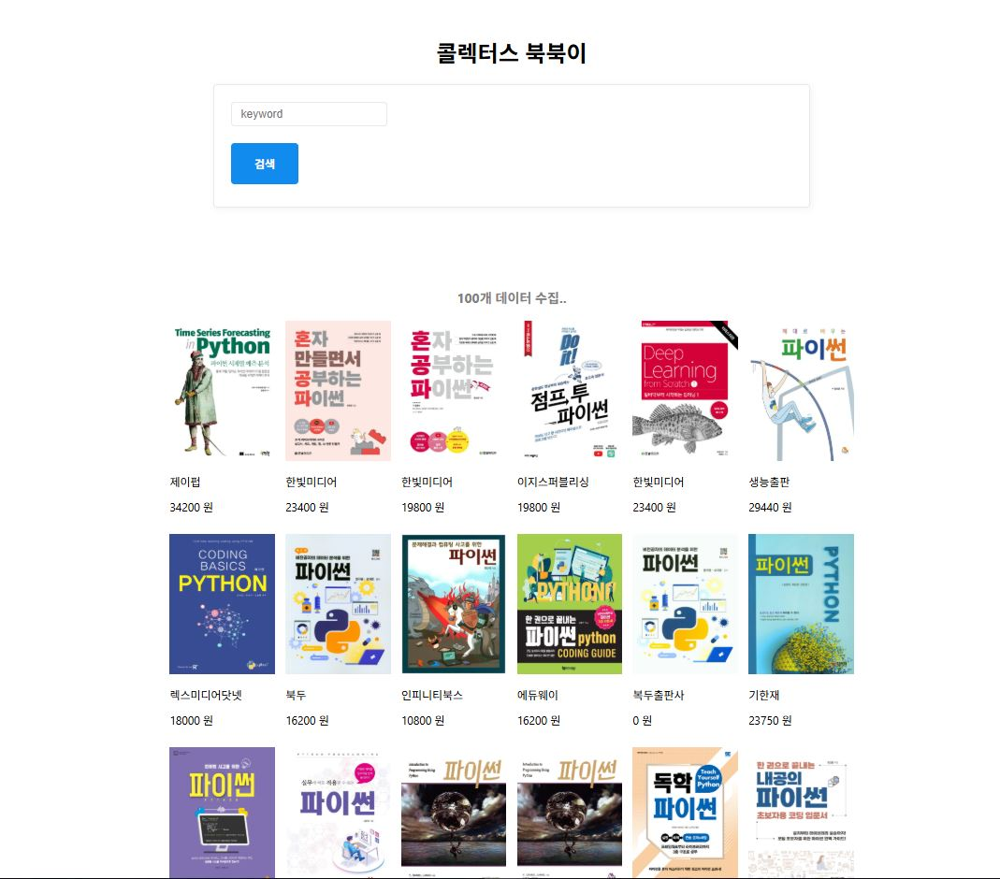

# fastapi_proj

**FastAPI 기반 크롤링 및 MongoDB 연결 프로젝트**입니다.  
네이버 도서 API를 활용하여 도서 정보를 수집하고, MongoDB에 저장하여 관리하는 데이터 수집 프로젝트입니다.

<br>

## 🛠 프로젝트 구성

- **백업엔드 프레임워크**: [FastAPI](https://fastapi.tiangolo.com/)
- **비동기 데이터베이스**: [MongoDB](https://www.mongodb.com/) + [Motor (AsyncIO MongoDB Driver)](https://motor.readthedocs.io/en/stable/)
- **템플릿 렌더링**: [Jinja2](https://jinja.palletsprojects.com/)
- **서버 실행**: [Uvicorn](https://www.uvicorn.org/), [AWS](https://aws.amazon.com/)


<br>

## 🔤 설치 및 실행 방법

### 1. 프로젝트 클론

```bash
git clone https://github.com/cyh5757/fastapi_proj.git
cd fastapi_proj
```

### 2. 가상환경 생성 및 활성화

```bash
# 가상환경 생성
python -m venv .venv

# (Windows)
.venv\Scripts\activate

# (Mac/Linux)
source .venv/bin/activate
```

### 3. 패키지 설치

```bash
pip install -r requirements.txt
```

또는 [uv](https://docs.astral.sh/uv/)를 설치했다면:

```bash
uv sync
```

### 4. 환경방법 설정

MongoDB 접속 정보를 `.env` 파일에 작성합니다.

```env
MONGO_URL=your_mongo_connection_string
MONGO_DB_NAME=your_database_name
```

### 5. 서버 실행

```bash
uvicorn app.main:app --reload
```

> 기본적으로 `localhost:8000` 에서 접속할 수 있습니다.

<br>

## 📁 주요 포범 구조

```
fastapi_proj/
│
├── app/
│   ├── main.py          # FastAPI 앱 실행
│   ├── config.py        # 환경방법 및 설정
│   ├── book_scraper.py  # 책 데이터 스크레이퍼
│   ├── models.py        # 데이터 목적 정의
│   └── templates/       # HTML 템플릿 파일
│
└── requirements.txt     # 패키지 목록

```

<br>

## ✨ 주요 기능

- `/` : 기본 홈 페이지 (HTML 템플릿 렌더링)
- `/search` : 키워드를 입력받아 책 정보 검색 및 저장
- MongoDB에 책 데이터 저장
- `.env`를 통해 설정 관리

<br>

## 📸 결과물





<br>

## 📝 참고사항

- 80번 포트 사용 시 `sudo` 권한이 필요할 수 있습니다.
- `uv` 설치가 필요할 경우 [uv 설치 가이드](https://docs.astral.sh/uv/)를 참고하세요.

<br>

## 📌 허용 계획

- API 개선 및 추가
- 검색 결과 페이지링 처리
- 사용자 인증 및 권한 부여 기능

